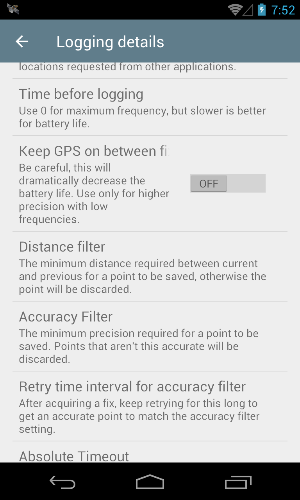

## What do the various settings mean? (Accuracy, retry interval for accuracy, etc)

**Logging interval** - How long to wait after a point has been logged to try logging again.

**Distance filter** - When a point becomes available, the app will check to ensure that this much distance exists between the previous and current points. If it isn't this distance, the point is discarded.

**Accuracy filter** - When a point becomes available, the app will check to ensure that this point has a minimum accuracy specified. If it does not match the specified accuracy, the point is discarded. This is useful if you are inside a building for a while.

**Duration to match accuracy** - When searching for a point, the app can continue searching for this many seconds until it finds a point that meets the accuracy and distance filter criteria above.

**Absolute timeout** - When searching for a point and trying over and over, the app will give up when this timeout is reached.  This is useful for when you're inside buildings, GPS tends to keep searching and finding nothing.  

**Keep GPS on between fixes** - Normally, the app stops using GPS between points, to save battery.  This means when it's time to log the next point, the GPS needs to be 'woken up' again and this takes a little time.  Keeping GPS on between fixes causes this 'wake up' time to be reduced.

**Don't log if I'm not moving** - Some Android phones come with activity recognition; the app can use this to determine if you are not moving and if so, it will not attempt to log a point. 